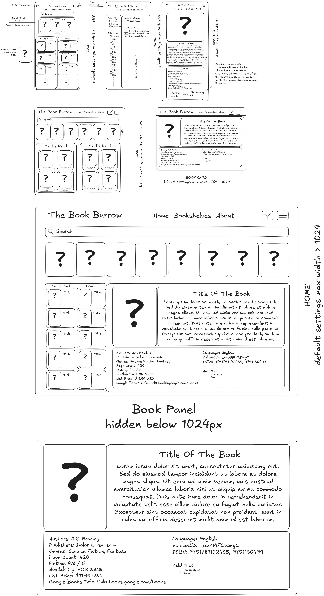

# The Book Burrow

The Book Burrow is a responsive website that allows the user to search for books, view information such as name, publisher, date published, synopsis, etc via [Google Books API](https://developers.google.com/books) Users can build bookshelves for books that they plan to read, and books they have already read.

# Current Phase : Planning

Landing page wireframes for small, medium, and large screens is done.  Still need to make wireframes for bookshelf page and book details for when the user is on mobile instead of desktop.

Vue 3 project created and cleaned up (removed default project).

Various wireframes created for different views and components.  Wireframes are located in the `./docs` folder.

