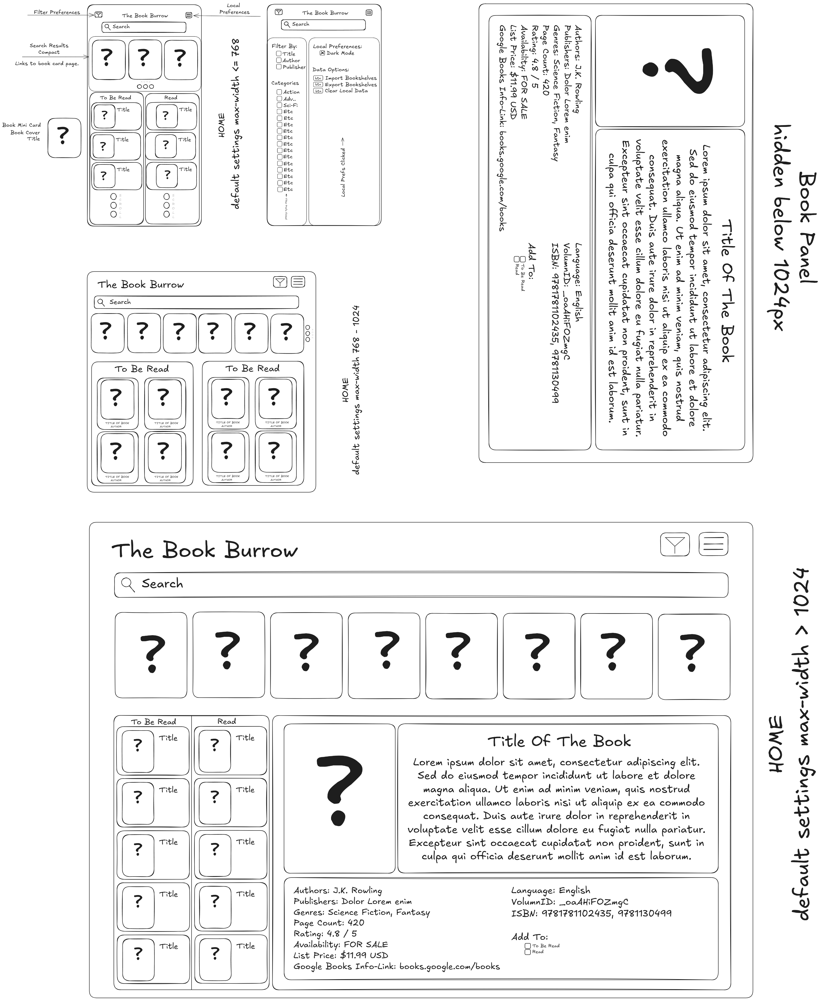

# The Book Burrow

The Book Burrow is a responsive website that allows the user to search for books, view information such as name, publisher, date published, synopsis, etc via [Google Books API](https://developers.google.com/books) Users can build bookshelves for books that they plan to read, and books they have already read.

# Current Phase : Planning

